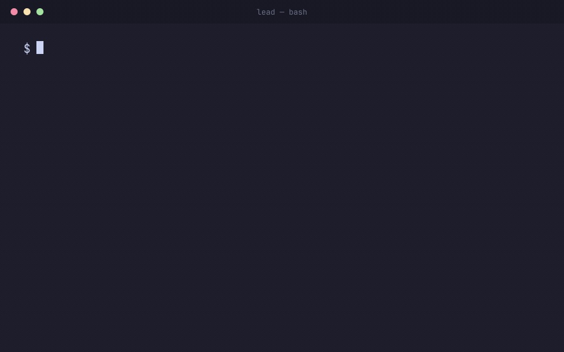

# Agentic Engineering Harness

A reference harness for **agentic engineering**: running multiple autonomous coding agents in parallel, under explicit workflows, with independent verification and human review gates — so one engineer can *supervise* engineering work instead of manually driving every keystroke.

This repository is documentation and conventions, plus the harness scripts and Atomic extensions that wire them together. It is not a new tool. It composes three existing tools into one operating model:

| Layer | Tool | Responsibility |
|-------|------|----------------|
| **Interaction surface** | [Ghostty](https://ghostty.org/) | A fast, native, terminal-first surface the engineer actually lives in. |
| **Workspace / operations** | [Herdr](https://herdr.dev/) (`herdrdev/herdr`) | Holds real terminals open, groups agent panes into workspaces, and reports each agent's live state (`working` / `blocked` / `done` / `idle`). |
| **Orchestration / verification** | [Atomic](https://github.com/bastani-inc/atomic) (`@bastani/atomic`) | Defines the engineering process as an explicit, versioned workflow with stages, parallelism, bounded retries, evidence, and approval gates. |

```text
Engineer
   │
Ghostty            ← native terminal surface the human uses
   │
Herdr              ← agent workspace + operations layer (panes, states)
   │
Atomic             ← workflow orchestration + verification
   │
Claude / Codex / … ← specialized agents, named by responsibility
   │
Evidence + Human Gates
   │
Pull Request
```

## See it run

In one terminal, start the build:

```bash
./build.sh
```

In a second terminal, attach to the cockpit to see and answer the question:

```bash
herdr --session harness
```

You are asked one question — **"What do you want to build today?"** — and the answer becomes
the project. A lead agent refines it into a mission, hires the roles that mission actually
needs, and drives the build. A Rust CLI gets a small team; a web app gets a larger one. You
watch the cockpit grow from one pane to N, and `build/ROSTER.md` records who was hired and why.



*Reconstructed from the recorded run in [docs/case-study-first-run.md](docs/case-study-first-run.md)
— real strings, not an invented demo. That run was stopped before it finished; no success
criterion was independently verified. Regenerate with `./scripts/render-demo.sh`.*

## Why

Adopting coding agents usually starts as *one engineer, one agent, one long prompt loop, many terminal windows*. That does not scale, and — more importantly — it does not stay **trustworthy** as you add agents. Parallelism without observability produces architectural drift, duplicated work, inaccessible UIs, and merge conflicts faster than a human can catch them.

The core principle of this harness:

> **Do not increase agent autonomy unless observability and verification increase with it.** Run as much engineering work autonomously as we can safely observe, verify, and understand — not as many agents as possible.

And the operating stance:

> **Do not make humans monitor agents. Make the harness monitor agents and bring humans the decisions that require human judgment.**

## What each layer does (and does not) do

- **Ghostty** is the human interaction surface. It does **not** own orchestration.
- **Herdr** manages *where and how* workers run — panes, workspaces, live agent state, persistence across a closed laptop lid. It does **not** replace Atomic's process definition.
- **Atomic** defines *what should happen* — the stages, the verification, the gates. It is **not** the UI the engineer stares at all day.

Atomic defines the process. Herdr runs and observes the workers. Ghostty gives the human a usable surface. Keeping these responsibilities separate is the central design decision (see [docs/architecture.md](docs/architecture.md)).

## Repository layout

```text
agentic-engineering-harness/
├── README.md                     ← you are here
├── AGENTS.md                     ← rules for coding agents working in THIS repo
├── build.sh                      ← the one command you run
├── team/
│   ├── ROLES.md                  ← the role library index: what to hire, and when
│   ├── TRANSPORT.md              ← how agents talk to each other (Atomic Intercom)
│   ├── lead.md                   ← the orchestrator's brief
│   └── *.md                      ← one brief per role, domain-neutral
├── atomic/
│   ├── README.md                 ← how workflows are defined and run
│   ├── extensions/
│   │   ├── build-intake.ts       ← asks what to build; writes build/IDEA.md
│   │   └── herdr-state.ts        ← projects Atomic session state into Herdr's sidebar
│   └── workflows/
│       └── feature-development.ts← the reference feature workflow (process spec)
├── docs/
│   ├── architecture.md           ← the three-layer model, in depth
│   ├── getting-started.md        ← install + first build
│   ├── operating-model.md        ← goal/scope/context/constraints/verification/approval
│   ├── monitoring-agents.md      ← supervision by exception, agent states
│   ├── verification-and-gates.md ← independent verification + human review gates
│   ├── security.md               ← least privilege + isolation
│   └── case-study-first-run.md   ← a real run, start to finish
├── herdr/                        ← setup, workspace conventions, Atomic integration
├── ghostty/                      ← recommended terminal config
└── scripts/
    ├── team.sh                   ← the lead hires with this: team.sh add <role>
    ├── setup.sh                  ← install Atomic + Herdr + Ghostty
    ├── new-workspace.sh          ← create a Herdr workspace for an outcome
    ├── launch-feature.sh         ← drive the feature-development workflow across panes
    ├── sync-workflows.sh         ← make repo workflows discoverable by Atomic
    └── status.sh                 ← roll up agent states (supervision by exception)
```

## Quick start

```bash
./scripts/setup.sh    # installs Atomic + Herdr + Ghostty, wires state + syncs workflows
claude                # run once to log in (optional; only if you use Claude Code directly)
atomic                # run once, then /login → Claude Pro/Max
./build.sh            # asks what to build, then builds it
```

Full install detail, including the manual steps, is in [docs/getting-started.md](docs/getting-started.md).

## Start here — a reading order

New to this repo? Read in this order:

1. **[docs/architecture.md](docs/architecture.md)** — the three layers and why they stay separate.
2. **[docs/operating-model.md](docs/operating-model.md)** — how you *supervise* this instead of driving every step (goal · scope · context · constraints · verification · approval).
3. **[docs/verification-and-gates.md](docs/verification-and-gates.md)** — the half that keeps parallel agents trustworthy: independent verification + human gates.

### Getting the best out of Atomic

Atomic is the orchestration/verification engine, and the highest-leverage thing to learn.

1. **[atomic/README.md](atomic/README.md)** — how workflows are defined (TypeScript), the `ctx` primitives, DAG rules, and when to reuse built-ins (`goal`, `ralph`, …) instead of hand-rolling.
2. **[atomic/workflows/feature-development.ts](atomic/workflows/feature-development.ts)** — an annotated reference workflow: fan-out research → plan → gate → implement → verify → **bounded, DAG-unrolled repair** → gate → PR.
3. **[docs/case-study-first-run.md](docs/case-study-first-run.md)** — one real run end to end: the question, the refined mission, the roster the lead chose and why, and the evidence it finished with.

The one-line lesson: **describe the outcome and its acceptance criteria, bound the turns, and let independent verifiers — not the author — decide "done."**

## Design principles

1. **Workflows over mega-prompts.** Repeatable engineering behavior belongs in a versioned workflow, not in a prompt you retype.
2. **Parallelize independent work; synthesize before deciding.** Don't parallelize tightly-coupled work just to raise the agent count.
3. **Keep agent context small.** Each agent gets only what it needs and returns a concise artifact. The workflow carries the larger context.
4. **Artifacts are handoffs.** Findings become files (`research/`, `specs/`, `artifacts/`), not conversational memory.
5. **Independent verification.** The agent that wrote the code is not the only agent that decides it is correct. Evidence beats self-report.
6. **Human gates where the cost of a wrong decision is high** — product, UX, accessibility, architecture, security, release.
7. **Bound autonomous loops.** Every retry loop has a max and an escalation path.
8. **Least privilege.** Prefer isolated environments; scope credentials to the minimum.
9. **Name agents by responsibility, not model.** The model is an implementation detail.

## Status

- The three-layer operating model, docs, conventions, and the Atomic workflow spec are complete and grounded in the installed tool versions (Atomic `0.9.12`, Herdr `0.8.0`, Ghostty `1.3.1`).
- A first-class **Atomic ↔ Herdr adapter** (a single command surface that projects Atomic workflow state into the Herdr sidebar) does **not** yet exist in either tool. It is documented as a target in [herdr/atomic-integration.md](herdr/atomic-integration.md) and is not implemented here. `build.sh` and `scripts/team.sh` wire the two layers with scripts today.
- No remote is configured — this repo is local by default. Clone it, read the [reading order](#start-here--a-reading-order) above, and run `./build.sh`.
- **The harness builds whatever you point it at.** `./build.sh` asks what you want, refines it with Atomic's `prompt-engineer` skill into a mission, and composes a team to build it. See [docs/case-study-first-run.md](docs/case-study-first-run.md) for a recorded run.
