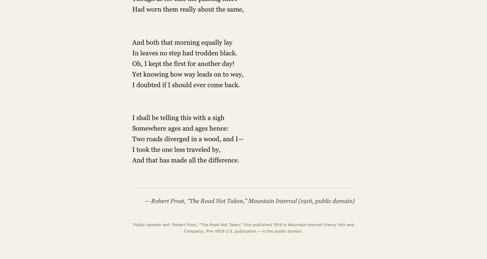

# Agentic engineering harness

This project lets you ask AI agents to build software for you.

You type what you want. A team of AI agents plans it, builds it, and checks the work. You
watch them and make the big decisions.

## What this does

You run one command. The computer asks you one question:

> What do you want to build today?

You answer in your own words. For example: *an accessible to do app using shadcn*.

Then:

1. One agent turns your answer into a written plan.
2. It shows you the plan. **Nothing else happens until you say yes.**
3. It starts the other agents it needs. A small job gets a small team.
4. The agents build the software. They talk to each other while they work.
5. One agent checks the work. It is not the agent that wrote the code.


*This picture is a re-creation of a real run. The words in it are real. This run finished:
all 8 goals passed, checked by a separate agent and then by a person. It also stalled for 19
minutes partway through — the team could not find its own lead. The status list showed a
healthy team the whole time; the problem was only visible in the pane text itself, not in the
status word. That is fixed now. Read what happened in
[docs/case-study-poem-page.md](docs/case-study-poem-page.md).*

## Before you start

You need three things:

- **A Mac.** These steps are tested on macOS. They may not work on Windows or Linux.
- **A terminal app.** This is a program where you type commands. The setup installs one
  called Ghostty.
- **A Claude Pro or Max account.** The agents use it to think. It costs money to run them.

**This is not free.** Each agent uses your Claude account while it works. A team of five
agents costs about five times as much as one. You can stop them at any time. See
[How to stop](#how-to-stop).

## Set up (you do this once)

### Step 1: Get the project

Open your terminal app. Type this and press Return:

```bash
git clone https://github.com/mpaiva/agentic-engineering-harness
cd agentic-engineering-harness
```

**You will see:** lines of text about downloading files.

### Step 2: Install the tools

Type this and press Return:

```bash
./scripts/setup.sh
```

**You will see:** a list of green check marks (✓). This can take a few minutes.

If you see a red ✗, the message tells you what to fix. Fix it, then run the command again.

### Step 3: Log in

Type this and press Return:

```bash
atomic
```

A program opens. Type `/login` and press Return. Choose **Claude Pro/Max**. Follow the steps
in your web browser.

**You will see:** a message that says you are logged in.

To leave the program, hold **Control** and press **C**. Do this twice.

**You are now set up.** You will not need to do these three steps again.

## Build something

You need **two terminal windows** for this. The first one runs the build. The second one is
where you answer questions.

### Step 1: Start the build

In your first terminal window, type this and press Return:

```bash
./build.sh
```

**You will see:** a message telling you to open a second window. The first window then waits.
This is normal. Leave it open.

### Step 2: Open the second window

Open a new terminal window. Type this and press Return:

```bash
herdr --session harness
```

**You will see:** a dark screen with a box in the middle. The box asks:
*What do you want to build today?*

### Step 3: Answer the question

Type what you want to build. Use normal words. You do not need to be technical.

Good answers look like this:

- *a to do list app I can use with a keyboard only*
- *a tool that turns a spreadsheet into a web page*
- *a program that renames my photo files by date*

Press Return when you are done.

**You will see:** the screen change while an agent writes your plan. This takes a minute or
two.

### Step 4: Read the plan and say yes

The agent shows you a plan. It asks: *Proceed as written?*

Read the plan first. Look for:

- **Goal** — what you will have at the end
- **Success criteria** — how you will know it worked
- **Non-goals** — what it will *not* build

If the plan looks right, choose yes.

If the plan looks wrong, say what to change. It is much cheaper to fix the plan now than to
fix the software later.

**You will see:** the screen split into boxes after you say yes. Each box is one agent.

### Step 5: Watch the agents work

Each box has a name, like `implementer` or `verifier`. Under each name is a word that tells
you what that agent is doing:

| Word | What it means |
|---------|---------------------------------------------|
| working | The agent is busy. |
| idle | The agent is waiting for work. |
| blocked | **The agent needs you.** Read that box. |
| done | The agent finished its task. |

You do not need to read every box. Watch for the word **blocked**. That is the one that
needs you.

Your files are saved in a folder called `build`.

## How to stop

You can stop at any time. Type this in any terminal window and press Return:

```bash
herdr --session harness server stop
```

**You will see:** the agent boxes close. The agents stop. Nothing more is charged to your
account.

Your files stay in the `build` folder. Nothing you built is deleted.

## If something goes wrong

| What you see | What to do |
|--------------|------------|
| The second window is empty, with no question | Wait 30 seconds. The agent may still be starting. |
| "atomic has no usable credential" | You are not logged in. Do [Step 3: Log in](#step-3-log-in) again. |
| "herdr not found" or "atomic not found" | The setup did not finish. Run `./scripts/setup.sh` again. |
| "build/ already holds a run" | You have an unfinished build. To continue it, run `./build.sh --resume`. To start fresh, rename the `build` folder. |
| An agent stopped and you do not know why | Its notes are saved in `build/.launch/`. Each agent has a file ending in `.stderr.log`. |
| You want to start over completely | Run the stop command above. Then rename the `build` folder. Then run `./build.sh`. |

## Words used in this project

| Word | What it means here |
|------|--------------------|
| Agent | An AI that does one job, like writing code or checking work. |
| Lead | The agent in charge. It writes the plan and starts the other agents. |
| Mission | The written plan, saved as `build/MISSION.md`. |
| Roster | The list of agents chosen for your job, saved as `build/ROSTER.md`. |
| Role | The job an agent does, such as `designer` or `verifier`. |
| Pane | One box on the screen. Each agent gets one. |
| Session | One run of the whole team. This one is named `harness`. |
| Gate | A point where the work stops and waits for your answer. |

## How it works

This project joins three tools that already exist. It does not replace them.

| Tool | What it does here |
|------|-------------------|
| [Ghostty](https://ghostty.org/) | The terminal app you type in. |
| [Herdr](https://herdr.dev/) | Shows each agent in its own box. Tells you what each one is doing. |
| [Atomic](https://github.com/bastani-inc/atomic) | Runs the agents. Keeps them to the plan. |

The agents send messages to each other while they work. They do not send every message
through you.

## Rules this project follows

1. **Ask before spending.** You approve the plan before any team starts.
2. **The writer does not grade its own work.** A separate agent checks it.
3. **Show proof, not promises.** "It works" is not enough. The proof is the command that was
   run and what it printed.
4. **Only hire who is needed.** A small job gets a small team.
5. **Stop instead of guessing.** An agent that is stuck asks you. It does not invent an
   answer.
6. **Write things down.** Agents share files, not memory.

## Learn more

These pages have more detail. They are written for people who want the full picture.

- [docs/getting-started.md](docs/getting-started.md) — setup, with every step spelled out
- [docs/case-study-first-run.md](docs/case-study-first-run.md) — a real run, including what broke
- [docs/architecture.md](docs/architecture.md) — how the three tools fit together
- [docs/monitoring-agents.md](docs/monitoring-agents.md) — how to watch a team without reading everything
- [docs/verification-and-gates.md](docs/verification-and-gates.md) — how the work gets checked
- [docs/security.md](docs/security.md) — how to run this safely
- [team/ROLES.md](team/ROLES.md) — every agent role, and when it is used

## What is finished and what is not

**A full build has now worked, start to finish.**

Someone asked for *"a single HTML landing page that reveals one verse of a public-domain poem
every 10 seconds until the whole poem is shown, ending with the author signature."*

Here is what happened:

- Two agents were started for the job: one to build, one to check.
- The page was built as one HTML file.
- It shows Robert Frost's poem *The Road Not Taken*, one verse every 10 seconds.
- It ends with the author's signature, then stops.
- The checking agent tested all 8 goals. **All 8 passed.** Nothing had to be fixed.
- A person then opened the page and watched it, to be sure.



You can open the page the agents built: [docs/samples/poem-page.html](docs/samples/poem-page.html).
Save it and open it in a web browser. Wait about 40 seconds to see the whole poem.

Read the full story in [docs/case-study-poem-page.md](docs/case-study-poem-page.md).

**This works:**

- The question, the plan, and the approval step.
- Choosing a team that fits the job. A small job gets two agents. A bigger one gets more.
- Agents talking to each other while they work.
- Seeing what each agent is doing.
- Building real, working software and proving it works.

**Restarting a stopped build works:**

If a build stops before it is done, you can start it again:

```bash
./build.sh --resume
```

We tested this. We stopped a build on purpose, then started it again. The lead agent came
back, read the plan, and carried on. It did not ask the question again, and it did not make
you approve the plan a second time.

The test found three problems. All three are fixed.

**This is still rough:**

- The first two tries failed before any build worked. Both problems are now fixed. You can
  read what broke in [docs/case-study-first-run.md](docs/case-study-first-run.md).
- We have not yet used `--resume` to finish a job that was left half done. Our test brought
  back a job that was already complete. So restarting works. Picking up unfinished work is
  not proven.
- Bigger jobs have not been finished yet. The largest job tried so far was stopped early.

Tested with Atomic 0.9.12, Herdr 0.8.0, and Ghostty 1.3.1.
