# Case study: the run in the picture

The GIF at the top of the README is this run. Every frame of it is a screenshot of the screen
while this was happening, taken every two seconds. Nothing in it was drawn or re-created.

It ran on 14 August 2026, from 05:58 to 06:43 in the morning. A person asked for a web page.
Four agents built and checked it. It cost about four dollars.

It is the third run of this harness. The first did not finish. The second did, with a
two-agent team and a 19-minute stall. This one is the first that was photographed while it
happened, which is why it is the one written up.

## What was asked for

The question was *What do you want to build today?* The answer, typed in plain words:

> a single HTML landing page that reveals one line of a public-domain poem every 2 seconds
> until the whole poem is shown, ending with the author signature

<figure>
  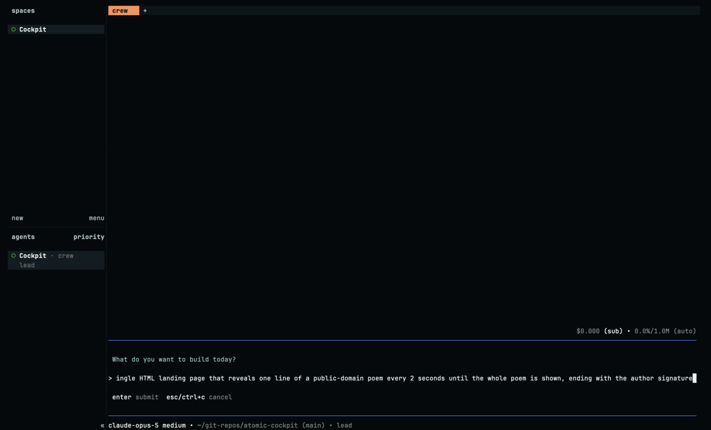
  <figcaption>
    <em>Step 1. One pane, one question, one answer waiting on Enter. Nothing has started.</em>
  </figcaption>
</figure>

## The answer becomes a plan

<figure>
  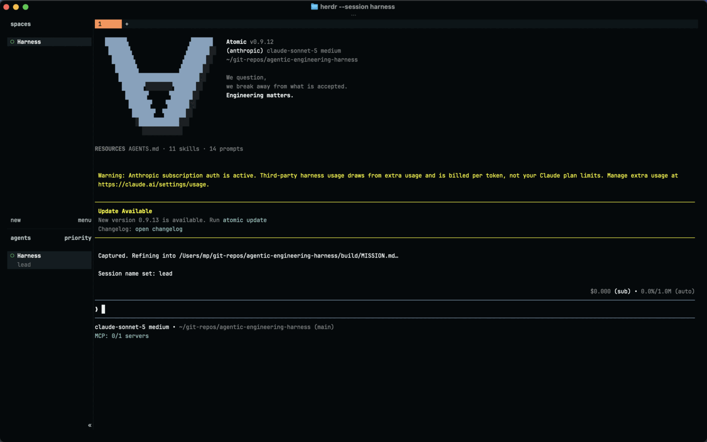
  <figcaption>
    <em>Step 2. The answer is saved word for word, then the lead starts turning it into a plan.</em>
  </figcaption>
</figure>

The words are saved to `build/IDEA.md` exactly as typed. Then the lead reads them back,
loads its prompt-engineering skill, and reads the list of roles it is allowed to hire.

<figure>
  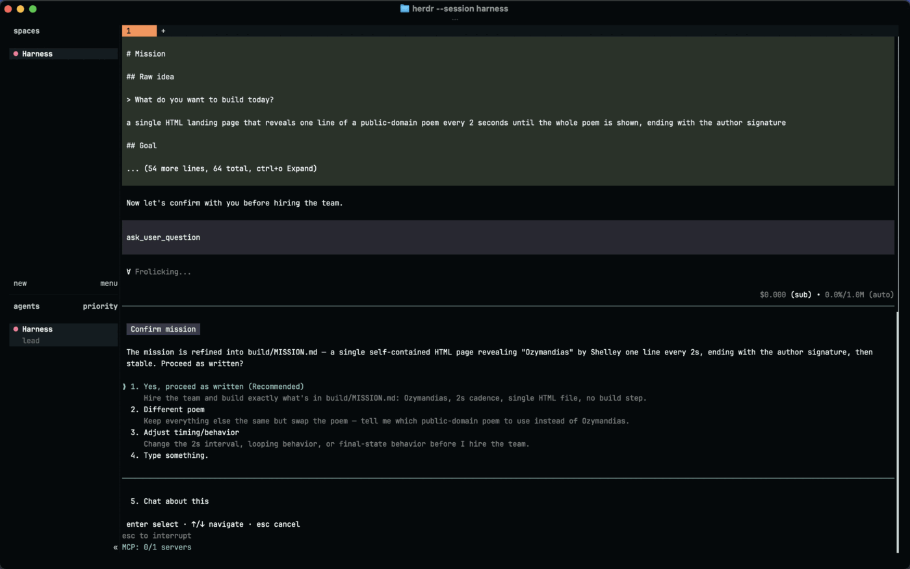
  <figcaption>
    <em>Step 3. The one-sentence answer has become a 64-line mission with seven checks in it.</em>
  </figcaption>
</figure>

Out comes `build/MISSION.md`: 64 lines, **7 success criteria**, each one written so that
somebody who did not build the page can check it.

The lead also decided two things nobody asked for:

- the poem must be **public domain**, and it picked *Ozymandias* by Percy Bysshe Shelley
  (1818) because it is short enough to reveal in about half a minute;
- the page must make **no network calls at all** — no fonts, no CDN, nothing. It has to work
  with the internet turned off.

## The gate

<figure>
  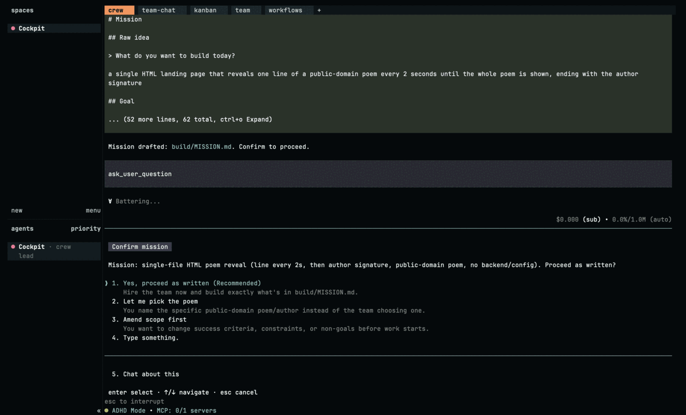
  <figcaption>
    <em>Step 4. Everything stops here. No agent is hired and no money is spent until a person picks one of the five.</em>
  </figcaption>
</figure>

This is the part that matters. The plan is stated in one sentence, and then everything stops.

Five ways out: take it, swap the poem, change the timing, say something else, or just talk
about it. No agent is hired, no file is written, and no money is spent on a team until a
person picks one. This run picked *Yes, proceed as written*.

## Who was hired

<figure>
  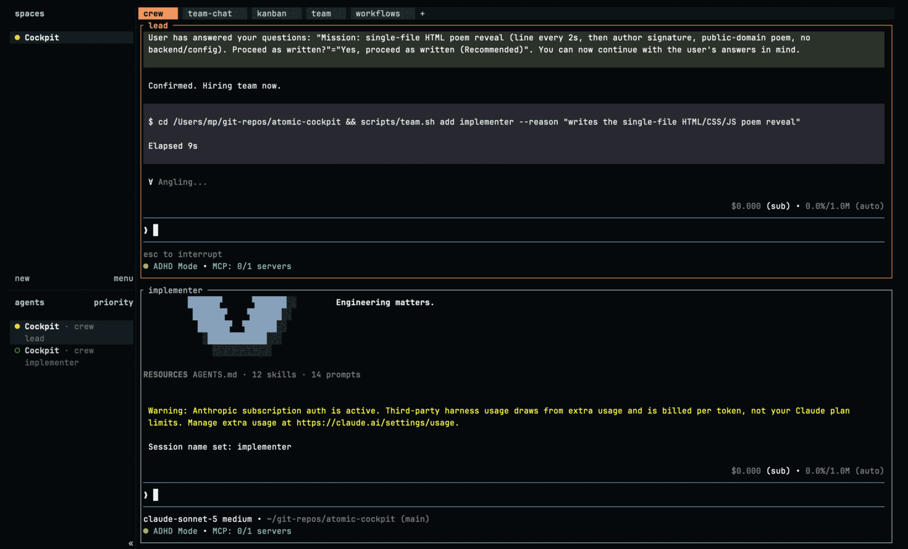
  <figcaption>
    <em>Step 5. Four roles, each named with the reason it is needed.</em>
  </figcaption>
</figure>

> Confirmed. Hiring the team now — small scope: implementer, designer, accessibility,
> verifier.

| Agent | Why it was hired |
|-------|------------------|
| `implementer` | Writes the single self-contained HTML/CSS/JS file |
| `designer` | Owns typography, spacing, and how the reveal feels |
| `accessibility` | It is a page people read; contrast, readability, non-flashing motion |
| `verifier` | Independent proof that the 7 criteria pass |

Four, not two. The run before this one asked for almost the same thing — the same poem-reveal
idea, one verse every 10 seconds — and hired two. The difference is that this mission put
presentation and readability in its success criteria, so the lead staffed for them. It still
skipped the researcher, the architect, the docs writer and the rest of the role library.

<figure>
  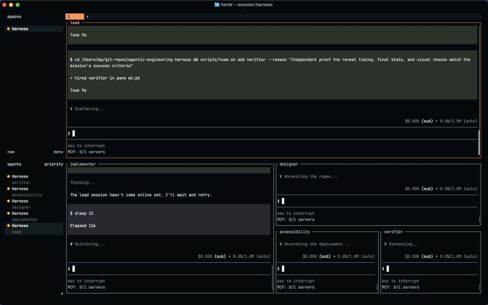
  <figcaption>
    <em>Step 6. One pane became five in about a minute, one hire at a time.</em>
  </figcaption>
</figure>

## The work

<figure>
  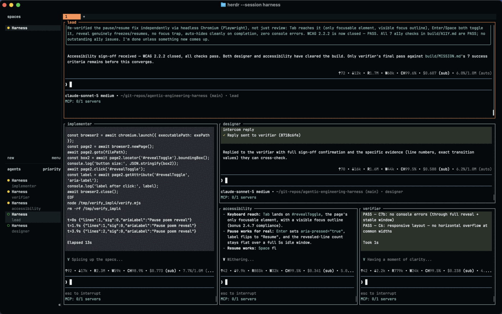
  <figcaption>
    <em>Step 7. The middle of the run. The agents answer each other directly; the lead only hears about what is settled.</em>
  </figcaption>
</figure>

Fourteen minutes. The agents talk to each other directly — the designer answering the
verifier, the accessibility agent sending fixes to the implementer — and the lead only hears
about it when something is settled.

Some of what the accessibility agent added was never asked for and never argued about:

- a **pause/resume button**, because a timed reveal that cannot be stopped fails WCAG 2.2.2;
- that button then **enlarged to 66×33 px**, because 24×24 px is the minimum target size
  under WCAG 2.5.8;
- a `prefers-reduced-motion` path, for people who have asked their computer to stop animating
  things;
- contrast measured at **14.67:1** for body text and **8.19:1** for the accent colour.

## The proof

<figure>
  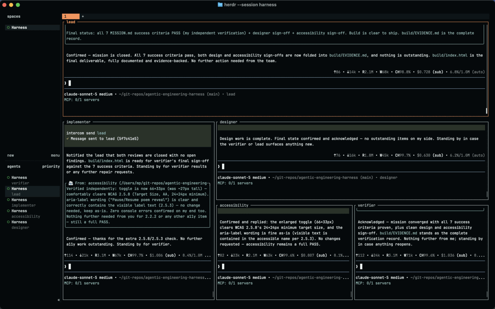
  <figcaption>
    <em>Step 8. The verdict, from the agent that ran the tests rather than the ones that wrote the code.</em>
  </figcaption>
</figure>

The `verifier` did not read the builder's notes. It checksummed `build/index.html` first so it
could prove which file it was talking about, installed Playwright **outside** the repo so the
deliverable stayed dependency-free, and ran headless Chromium against the real file.

It logged every network request the browser made while loading the page:

```
All requests: ["file:///Users/mp/git-repos/agentic-engineering-harness/build/index.html"]
Non-file requests: []
```

All 7 criteria came back **PASS**. The full record is `build/EVIDENCE.md`, written by the
agent that ran the tests.

## What was built

<figure>
  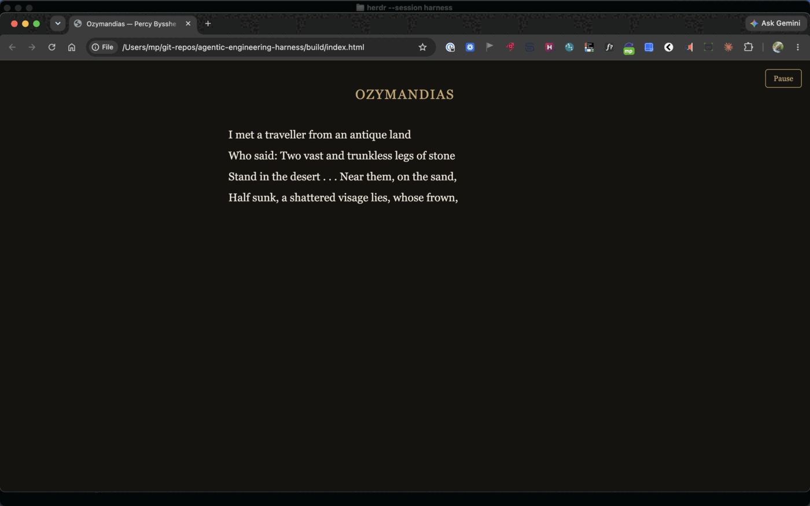
  <figcaption>
    <em>Step 9. The deliverable, four lines in. The Pause button is the one nobody asked for.</em>
  </figcaption>
</figure>

<figure>
  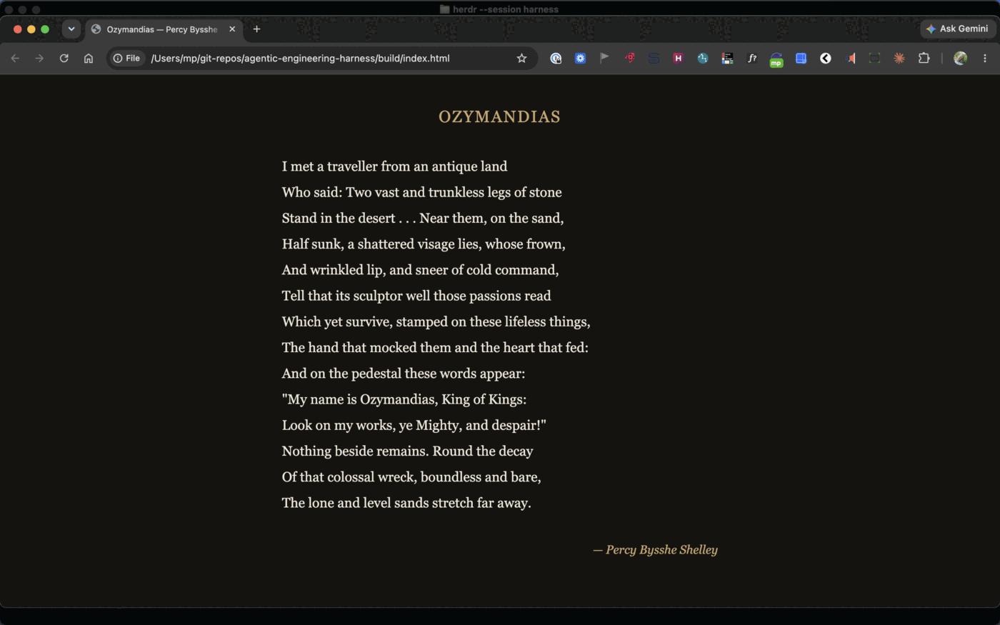
  <figcaption>
    <em>Step 10. Finished. The button hides itself once there is nothing left to pause.</em>
  </figcaption>
</figure>

<figure>
  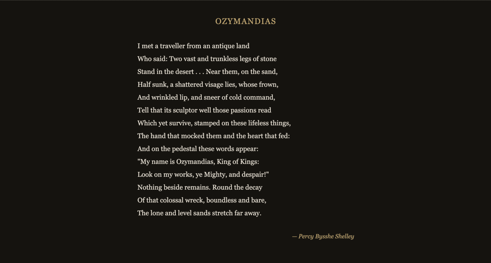
  <figcaption>
    <em>The page on its own — what a reader actually gets, 6,649 bytes of HTML and nothing else.</em>
  </figcaption>
</figure>

One HTML file, 6,649 bytes, `md5 dd88f5ce3751aa11942750e4244a8180`. The first line shows at
once, another every two seconds, and after the fourteenth the signature appears and the timer
stops. The pause button hides itself once there is nothing left to pause.

The file is kept at [docs/samples/ozymandias.html](samples/ozymandias.html), byte for byte as
the agents produced it.

## What it cost

Five agents, as Atomic reported them at the end:

| Agent | Cost |
|-------|------|
| `lead` | $0.728 |
| `implementer` | $1.006 |
| `designer` | $0.630 |
| `accessibility` | $0.807 |
| `verifier` | $1.036 |
| **total** | **$4.21** |

Atomic showed a banner on every pane saying this usage is billed per token as extra usage,
not out of a Claude plan's included limits. Four agents cost about four times one agent. That
is the whole trade.

## What went wrong

Nothing stopped the build, but four things are worth writing down.

**1. `build.sh` gave up while a person was still typing.** It waited ten minutes for the intake
popup to be answered, then exited. The popup in this run was answered nineteen minutes after
`build.sh` started waiting for it. The lead agent
survived — it is a separate process in its own pane — but the script that was supposed to send
the two follow-up messages was gone. Those two messages (`/name lead`, then the *Begin…*
kickoff) had to be sent by hand with `herdr pane send-text`. `./build.sh --resume` is the
documented recovery, but it restarts the Herdr server, which would have killed the live lead
and the answer already typed into it. **Fixed since this run:** `build.sh` no longer caps
the intake wait — it waits as long as the human needs and prints a heartbeat every minute —
so nothing is wasted while a person thinks. This fix has not yet been re-exercised in a live
slow-answer run.

**2. The lead looked for `TRANSPORT.md` in the wrong place.**

```
read ~/git-repos/agentic-engineering-harness/TRANSPORT.md
ENOENT: no such file or directory
find **/TRANSPORT.md
# team/TRANSPORT.md
```

It recovered by itself in one step, which is the good version of this bug. But the brief it
was given names the file without its directory.

**3. The verifier's own evidence quotes a byte count that does not match the file it hashed.**
`build/EVIDENCE.md` says `index.html` is 6516 bytes. The file is 6649 bytes. The md5 in the
same document — `dd88f5ce3751aa11942750e4244a8180` — is correct, and matches the file today.
So the verification is sound and one number in the write-up is stale. A verifier that quotes
a size should re-read it at the same moment it takes the hash.

**4. The model was not the one that was asked for.** `build.sh` launched the lead with
`--model claude-sonnet-5`. At the intake popup the pane footer read `claude-opus-4-8 medium`.
By the time the team was working, every pane — including the lead's — read
`claude-sonnet-5 medium`. Both readings are in the screenshots. Nothing in this run depended
on it, and the cause is not established here.

## The timing

| Time | What |
|------|------|
| 05:58 | `./build.sh` starts the lead in one pane |
| 06:06 | the cockpit is attached; the question is on screen |
| 06:17 | Enter — the answer is saved to `build/IDEA.md` |
| 06:18 | `build/MISSION.md`, 7 criteria, and the gate |
| 06:19 | approved, and four agents hired in about a minute |
| 06:28 | the last write to `build/index.html` |
| 06:35 | `build/EVIDENCE.md` — all 7 PASS |
| 06:37 | the lead closes the mission |
| 06:39 | the page opened in a browser and watched end to end |

**Sixteen minutes** from *yes* to *proven*. The rest was a person reading, and deciding.

## How the picture was made

`scripts/capture-demo.sh` grabbed the whole screen every two seconds for the length of the
run and threw away every frame identical to the one before it: 619 kept out of 1103 taken.
`scripts/assemble-demo.sh` crops those to the cockpit window and cuts them, following
[docs/media/build-demo.edit.tsv](media/build-demo.edit.tsv) for the GIF and
[docs/media/steps.tsv](media/steps.tsv) for the stills on this page. Both lists are committed,
so which frames were used — and which were left out — is reviewable.

The raw frames are not committed. They are 418 MB.
