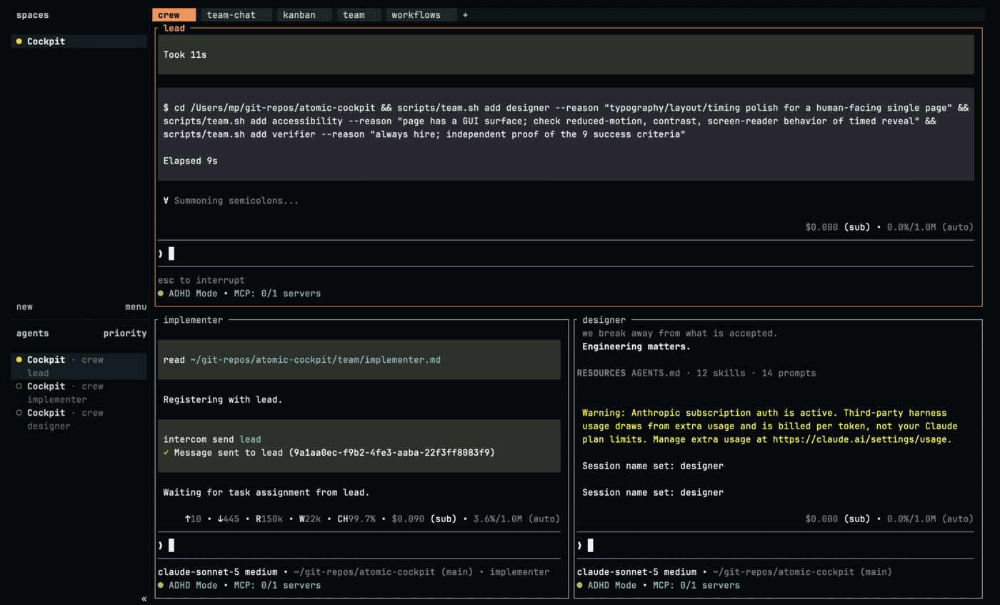
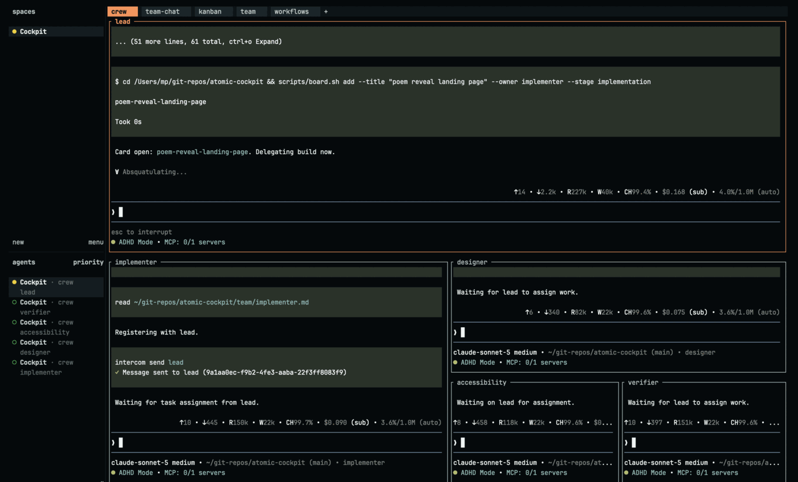
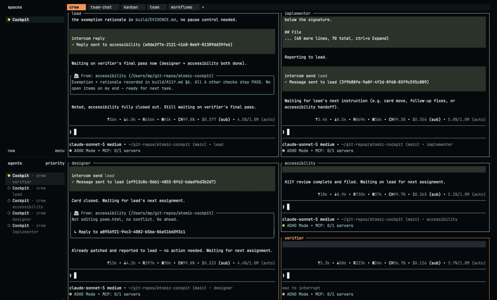
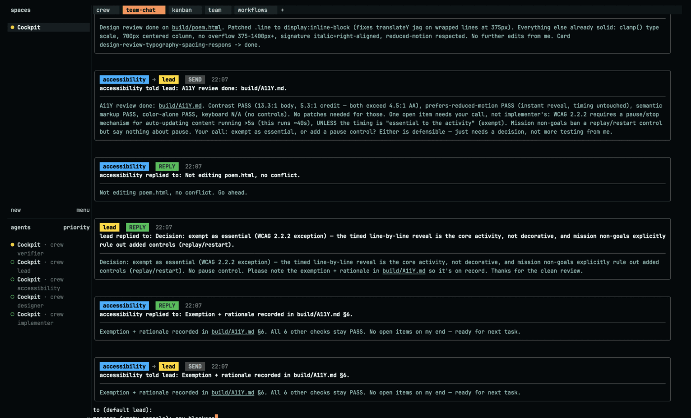
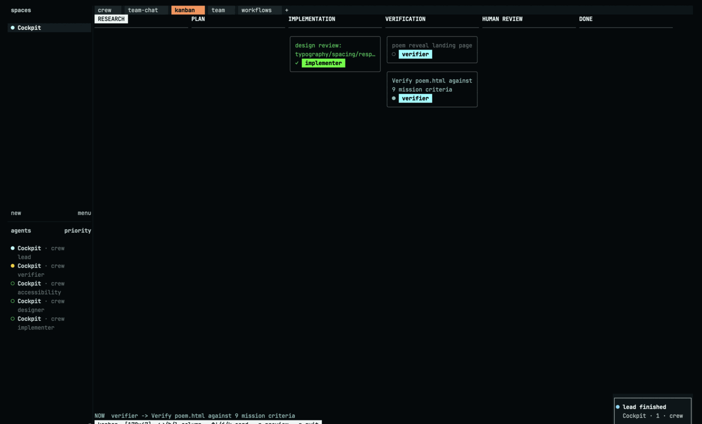
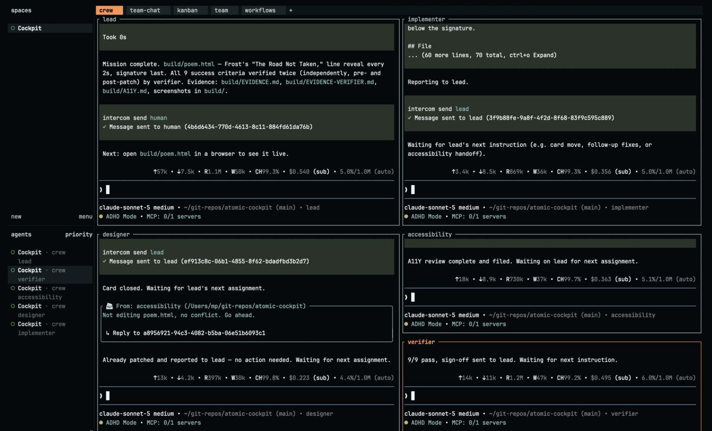
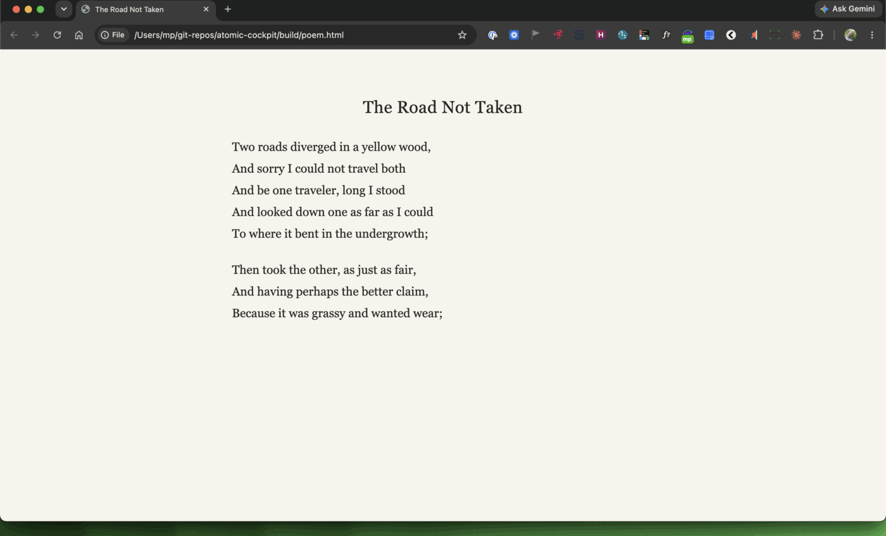
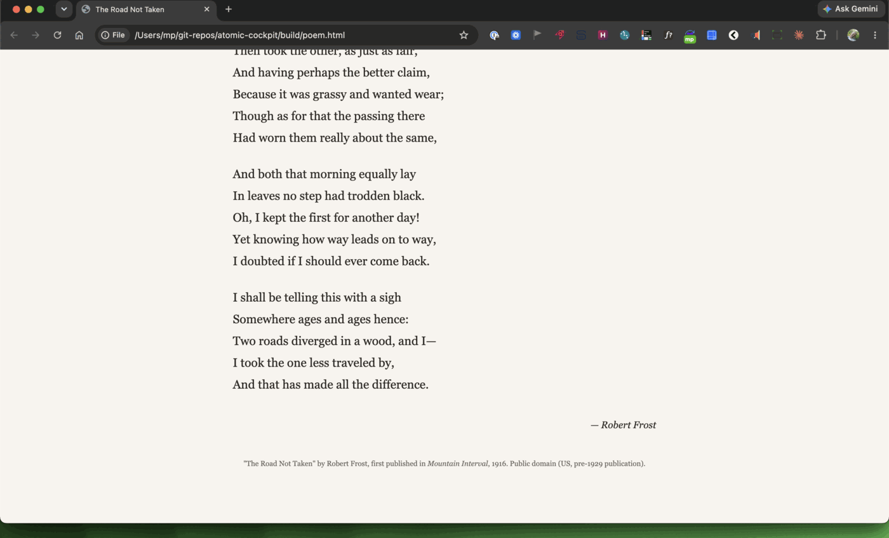
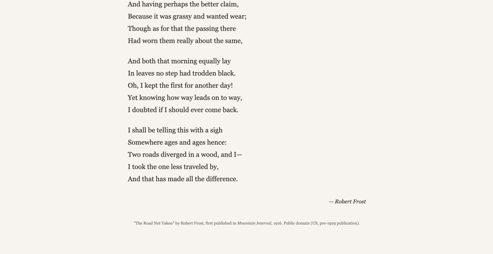

# Case study: the run in the picture

The GIF at the top of the README is this run. Every frame of it is a screenshot of the screen
while this was happening, taken every two seconds. Nothing in it was drawn or re-created.

It ran on 16 August 2026. A person asked for a web page in one sentence. Four agents built and
checked it. It took fourteen minutes from *yes* to *proven*, and cost about two dollars.

## What was asked for

The question was *What do you want to build today?* The answer, typed in plain words:

> a single HTML landing page that reveals one line of a public-domain poem every 2 seconds
> until the whole poem is shown, ending with the author signature

<figure>
  
  <figcaption>
    <em>Step 1. One tab, one pane, one question, and an answer waiting on Enter. Nothing has started.</em>
  </figcaption>
</figure>

## The answer becomes a plan

<figure>
  
  <figcaption>
    <em>Step 2. The answer is saved word for word, then the lead starts turning it into a plan.</em>
  </figcaption>
</figure>

The words go to `build/IDEA.md` exactly as typed. The lead then reads them back, checks it is
registered on the message broker under its own name, loads its prompt-engineering skill, and
reads the list of roles it is allowed to hire.

<figure>
  
  <figcaption>
    <em>Step 3. The one-sentence answer has become a mission with nine checks in it.</em>
  </figcaption>
</figure>

Out comes `build/MISSION.md` with **9 success criteria**, each written so somebody who did not
build the page can check it — a measurable cadence of 2000ms ± 100ms, no console errors from a
`file://` URL, no horizontal scroll at 375px or 1200px, the signature revealed last and
visually distinct.

The lead also decided things nobody asked for. The poem had to be **public domain** with the
source cited on the page itself; the file had to work opened straight from disk with no server,
no build step, and no CDN; and the choice of poem was left to the team, with the citation
treated as a success criterion rather than a nicety.

## The gate

<figure>
  
  <figcaption>
    <em>Step 4. Everything stops here. No agent is hired and no money is spent until a person picks one of the five.</em>
  </figcaption>
</figure>

This is the part that matters. The plan is stated in one sentence, and then everything stops.

Five ways out: take it, pick the poem yourself, amend the scope before any work starts, type
something of your own, or just talk about it. No agent is hired, no team file is written, and
no money is spent on a team until a person picks one. This run picked *Yes, proceed as
written*.

## Who was hired

<figure>
  
  <figcaption>
    <em>Step 5. Approved, and the first hire goes out within seconds.</em>
  </figcaption>
</figure>

<figure>
  
  <figcaption>
    <em>Step 6. Each hire carries its reason on the command line, so the roster is self-documenting.</em>
  </figcaption>
</figure>

The reasons are not decoration — `scripts/team.sh` writes them to `build/ROSTER.md`:

| Agent | Why it was hired |
|-------|------------------|
| `implementer` | writes the single-file HTML/CSS/JS poem reveal |
| `designer` | typography/layout/timing polish for a human-facing single page |
| `accessibility` | page has a GUI surface; check reduced-motion, contrast, screen-reader behavior of timed reveal |
| `verifier` | always hire; independent proof of the 9 success criteria |

Four hires, not six. The lead skipped the researcher, the architect, the product manager, the
devops and the docs roles, and the `team` tab shows each of them still sitting in the library
with the condition that would have justified hiring it.

<figure>
  
  <figcaption>
    <em>Step 7. One pane became five in about ninety seconds, one hire at a time.</em>
  </figcaption>
</figure>

## The work

<figure>
  
  <figcaption>
    <em>Step 8. The middle of the run. The agents answer each other directly; the lead only hears about what is settled.</em>
  </figcaption>
</figure>

Thirteen minutes, most of it quiet. The agents talk to each other directly rather than routing
everything through the lead — and the traffic is not just status. The designer, about to edit
`build/poem.html`, warned the accessibility agent first:

> Starting a design patch on `build/poem.html` now: converting `.line` spans to
> `display:inline-block` (fixes transform glitch on wrapped lines at 375px). One small, fast
> edit. Ping me if you're mid-edit on the same file so we don't clobber — otherwise I'll save
> in ~2 min.

It got an answer — *"Not editing poem.html, no conflict. Go ahead."* — and only then saved.

The accessibility agent found something the mission had not settled, and refused to settle it
itself:

> WCAG 2.2.2 requires a pause/stop mechanism for auto-updating content running >5s (this runs
> ~40s), UNLESS the timing is "essential to the activity" (exempt). Mission non-goals ban a
> replay/restart control but say nothing about pause. Your call: exempt as essential, or add a
> pause control? Either is defensible — just needs a decision, not more testing from me.

The lead ruled it exempt, because the timed reveal *is* the activity rather than decoration,
and told the agent to write the exemption and its rationale into `build/A11Y.md` so the
decision is on the record rather than in a chat log. It is there, as §6.

Everything else came back clean: contrast **13.3:1** for the poem text and **5.3:1** for the
small credit line, both over the 4.5:1 AA threshold; `prefers-reduced-motion` honoured with an
instant reveal; semantic markup and colour-independence fine; keyboard operability not
applicable, because the finished page has no controls at all.

## Watching it without reading five panes

Four side tabs open next to the crew. This is the first run photographed since they existed.

<figure>
  
  <figcaption>
    <em>Step 9. The team-chat tab: every message the agents sent each other, in one feed, newest last.</em>
  </figcaption>
</figure>

That feed is also a way in. Pressing `i` sends a message to the team as yourself — the pink
`human` badge partway down this screenshot is a question typed mid-run, *"any blockers?"*, and
the lead's reply arrived in the same feed nine seconds later.

<figure>
   Verify poem.html against 9 mission criteria&quot;." />
  <figcaption>
    <em>Step 10. The kanban tab: what is in flight, by stage, and who owns each card.</em>
  </figcaption>
</figure>

<figure>
  
  <figcaption>
    <em>Step 11. The team tab: who is hired, what each one is doing, and — usefully — who was not hired and what would justify it.</em>
  </figcaption>
</figure>

The fourth tab, `workflows`, stayed empty for this run: the lead hired directly rather than
launching a named Atomic workflow, so there was nothing to list. Photographing it is what
turned up the one real bug of the day.

<figure>
  
  <figcaption>
    <em>Step 12. The workflows tab with nothing to list — and, underneath the guidance, two
    lines of shell error that should not be there. This frame is kept exactly as it was taken;
    the bug it caught is written up below and fixed in the code.</em>
  </figcaption>
</figure>

## The proof

<figure>
  
  <figcaption>
    <em>Step 13. The verdict, from the agent that ran the tests rather than the ones that wrote the code.</em>
  </figcaption>
</figure>

The `verifier` did not take the implementer's numbers. It re-ran everything itself with
Playwright headless Chromium, installed **outside** the repo in `/private/tmp/pw-check` so the
deliverable stayed dependency-free, against the real file at a `file://` URL, at 1400px and
375px.

It also did the thing that makes a verifier worth its cost: it refused to sign off on a moving
target. Its first pass came back 9/9 while the designer and accessibility agent were still
patching, and it said so explicitly —

> Caveat: this is pre-designer/a11y-patch baseline — will re-run same script for final sign-off
> once they ping done, since cadence/stability are timer-logic and easy to break with unrelated
> edits.

— then re-ran the identical script after the patches landed, added a 320px check that was not
asked for, and independently confirmed the accessibility agent's two claims rather than quoting
them: it emulated `prefers-reduced-motion` itself, and sampled the rendered colours rather than
reading the hex values out of the CSS.

Both passes: **9/9 PASS**. Cadence deviated from 2000ms by at most 2–3ms. The record is
`build/EVIDENCE-VERIFIER.md`, written by the agent that ran the tests.

## What was built

<figure>
  
  <figcaption>
    <em>Step 14. The deliverable, nine lines in, revealing one line every two seconds.</em>
  </figcaption>
</figure>

<figure>
  
  <figcaption>
    <em>Step 15. Finished. The signature arrives last, and the timer stops.</em>
  </figcaption>
</figure>

<figure>
  
  <figcaption>
    <em>The page on its own — what a reader actually gets, 4,238 bytes of HTML and nothing else.</em>
  </figcaption>
</figure>

One HTML file, 4,238 bytes, `sha1 8d89c307595728ff6e2aed81be3ab183942c0845`. The first line
shows at once, another every two seconds, and after the twentieth the signature appears and the
timer is cleared. No controls, no network requests, no build step.

The file is kept at [docs/samples/road-not-taken.html](samples/road-not-taken.html), byte for
byte as the agents produced it.

## What it cost

Five agents, as Atomic reported them in the last frame of the run:

| Agent | Cost |
|-------|------|
| `lead` | $0.540 |
| `implementer` | $0.356 |
| `designer` | $0.223 |
| `accessibility` | $0.363 |
| `verifier` | $0.495 |
| **total** | **$1.98** |

Atomic showed a banner on every pane saying this usage is billed per token as extra usage, not
out of a Claude plan's included limits.

For comparison, the run this one replaced cost $4.21 for the same team size. The difference is
almost entirely wall-clock: that one spent forty-five minutes where this one spent eighteen.

## What went wrong

Nothing stopped the build. Two things are worth writing down.

**1. The `workflows` tab printed a shell error instead of its empty state.** With no runs
registered, the tab rendered this under the table:

```
./scripts/workflow-tab.sh: line 278: [: 0
0: integer expected
```

The cause is a common shell trap. `TOTAL="$(grep -c … || echo 0)"` looks safe, but `grep -c`
prints `0` **and exits 1** when it matches nothing, so the `|| echo 0` fires as well and `TOTAL`
becomes the two-line string `"0\n0"` — which every later `[ "$TOTAL" -gt 0 ]` rejects. It only
appears when the list is empty, which is exactly the state a first-time reader sees, and it had
survived since the tab was added because no earlier run had looked at it with no workflows
registered. Found by this recapture — step 12 above is the screenshot that caught it — and
fixed in `scripts/workflow-tab.sh` by assigning first and correcting on failure:
`TOTAL="$(grep -c … 2>/dev/null)" || TOTAL=0`. The picture is left as it was taken rather than
replaced with a clean one, so the claim can be checked against the evidence.

**2. `herdr tab focus` moves the tab, not the window.** Driving the tab tour from a script
switches which tab is *selected*, but does not raise the cockpit window on the desktop — so if
another window is in front, the screenshots keep photographing that other window while the tab
changes behind it. Nothing in the tooling warns you. This cost two spoiled capture attempts and
is the reason 115 of the 341 kept frames are of something other than the build.

## The timing

| Time | What |
|------|------|
| 17:15 | `./build.sh` starts the lead in one pane and waits |
| 17:58 | the cockpit is attached; the question is on screen |
| 18:00 | Enter — the answer is saved to `build/IDEA.md` |
| 18:00 | `build/MISSION.md`, 9 criteria, and the gate |
| 18:01 | approved; four agents hired in about ninety seconds |
| 18:06 | `build/poem.html` written; `build/EVIDENCE.md` filed |
| 18:07 | designer's wrap fix; accessibility review filed; the pause question answered |
| 18:10 | verifier pass 1 — 9/9, with a caveat that it will re-run |
| 18:14 | verifier pass 2, post-patch — 9/9, sign-off |
| 18:15 | the lead closes the mission |
| 18:18 | the page opened in a browser and watched end to end |

**Fourteen minutes** from *yes* to *proven*. The forty-three minutes before it were a person
getting round to answering the question — which costs nothing, because `build.sh` waits.

## How the picture was made

`scripts/capture-demo.sh` grabbed the whole screen every two seconds and threw away every frame
identical to the one before it: 341 kept out of 1,589 taken. `scripts/assemble-demo.sh` crops
those to the window and cuts them, following
[docs/media/build-demo.edit.tsv](media/build-demo.edit.tsv) for the GIF and
[docs/media/steps.tsv](media/steps.tsv) for the stills on this page. Both lists are committed,
with their reasoning in the header, so which frames were used — and which were left out, and
why — is reviewable without taking anyone's word for it.

The raw frames are not committed. They are 205 MB.
