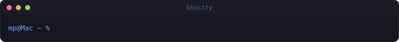
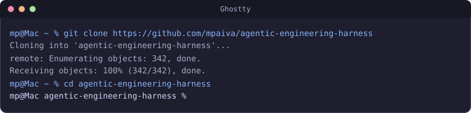
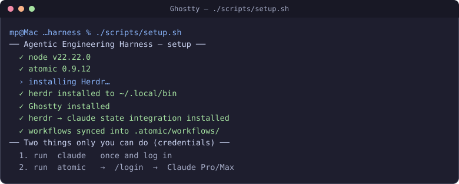
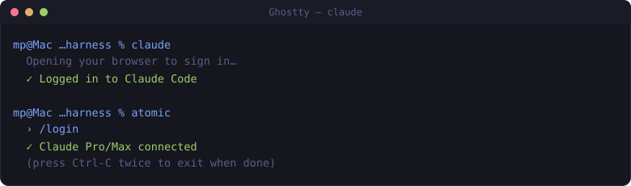
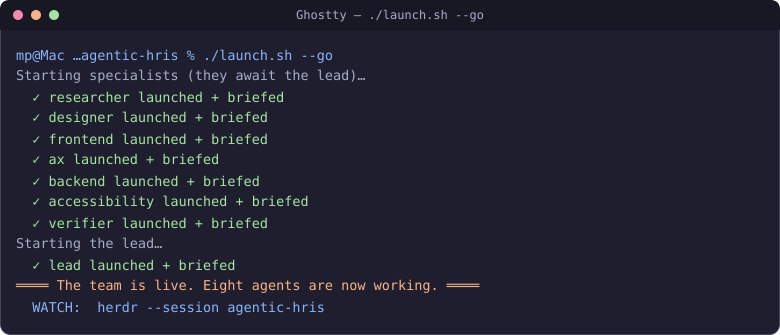
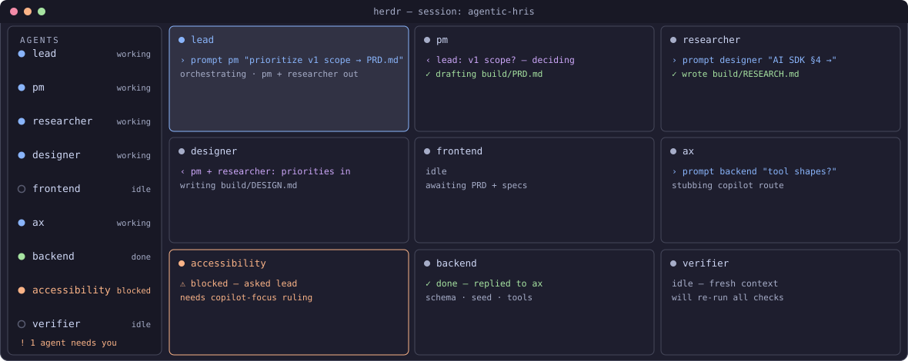
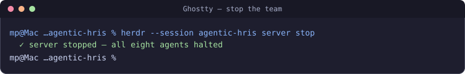

# Example: a Herdr-monitored autonomous agent team

This example stands up a **team of eight world-class Claude agents in a split-pane Herdr grid** and turns them loose to **autonomously build a greenfield agentic-first HRIS** — coordinating with each other, monitored live, pushing toward a single goal with minimal human gates.

It is deliberately the **opposite** of the [hcm-graph](../hcm-graph/README.md) example. Where that one uses Atomic's gated, verified workflows, this one explores **maximum autonomy**: agents talking to agents, driving to done on their own. It's a great way to *see* multi-agent coordination — and an honest look at **why the harness argues for gates and verification** (spoiler: full autonomy drifts; the `verifier` agent is the floor that keeps it honest).

## What you're watching

- **Herdr** is the cockpit. Eight agents, one per pane; the sidebar shows each one `working` / `blocked` / `done`. You supervise by exception — you only step in on the agent that needs you.
- **The agents communicate with each other** via `herdr agent prompt` — the `lead` delegates tasks, specialists report back, all visible in Herdr. (See the note on "intercom" below.)
- **The work is real:** a Next.js 15 + shadcn/Radix + Vercel AI SDK app with an in-app HR copilot, built under `build/` (git-ignored, created at runtime).

```text
┌───────────────┬───────────┐   lead          — principal engineer & orchestrator
│ lead          │ frontend  │   researcher     — decision-ready evidence (domain · stack · a11y)
├───────────────┼───────────┤   designer       — product/interaction design + agentic UX
│ designer      │ ax        │   frontend       — Next.js · shadcn/ui · Radix · Tailwind
├───────────────┼───────────┤   ax             — the agentic core: HR copilot (Vercel AI SDK)
│ accessibility │ backend   │   backend        — Drizzle + SQLite · server actions · copilot tools
├───────────────┼───────────┤   accessibility  — WCAG 2.2 AA guidance + review
│ researcher    │ verifier  │   verifier       — independent, fresh-context QA (floor of trust)
└───────────────┴───────────┘
```

The goal and definition of done: [MISSION.md](MISSION.md). The role briefs: [team/](team/).

## Step-by-step walkthrough (no experience needed)

Never used a terminal? That's fine. Do these steps **in order**. For each one: type the
command exactly as shown, press **Return**, and check your screen against the picture.

### Step 1 — Open the terminal

Open the app called **Ghostty**. You'll see a window like this — a blank line ending in `%`
is all you need.



### Step 2 — Get the code

Type these two lines, pressing **Return** after each:

```bash
git clone https://github.com/mpaiva/agentic-engineering-harness
cd agentic-engineering-harness
```



### Step 3 — Set up the tools (one command)

```bash
./scripts/setup.sh
```

This installs everything and finishes with a list of green ✓ checkmarks. If any line is a
red ✗, it tells you exactly what to do.



### Step 4 — Log in (one time only)

Two quick logins. Run the first, and a browser opens for you to sign in:

```bash
claude
```

Then, in the same window, start Atomic and log in there too:

```bash
atomic
```

…and type **`/login`**, then choose **Claude Pro/Max**. When both say “logged in”, press
**Ctrl** and **C** together, twice, to leave.



### Step 5 — Start the team

```bash
cd examples/agentic-hris
./launch.sh --go
```

Eight AI agents boot up and get their instructions. When you see **“The team is live”**,
they're off and working.



> First time? Run `./launch.sh` on its own first (no `--go`) — it just **prints the plan**
> and changes nothing, so you can see what will happen before you spend anything.

### Step 6 — Watch them work together

```bash
herdr --session agentic-hris
```

This is your **control room**. Each box is one agent; the lines inside show them **talking
to each other**. The list on the left shows who's *working*, *done*, or *stuck*. You don't
watch all of them — you watch for the one **amber dot** that says it needs you.



### Step 7 — Stop when you've seen enough

Leave the control room by pressing **Ctrl** and **C** together. Then stop the whole team:

```bash
herdr --session agentic-hris server stop
```



---

**Command reference** (once you're comfortable):

```bash
./launch.sh              # dry run — print the plan, change nothing
./launch.sh --layout     # build the split-pane grid only (no paid agents)
./launch.sh --go         # full launch — 8 live agents, autonomous
herdr --session agentic-hris                 # attach and watch
herdr --session agentic-hris agent read lead # peek at the lead's thinking
herdr --session agentic-hris server stop     # stop everything
```

## Read this before `--go` (the honest part)

- **It spends real tokens, continuously.** Eight agents running autonomously is the most expensive mode in this repo. Watch it and stop it.
- **`--go` starts each agent with `--dangerously-skip-permissions`.** Autonomous agents can't stop to ask permission for every command, so they don't. The guardrails are the isolated `build/` directory and the "only touch `build/`" instruction — **not** a sandbox. For anything beyond a demo, run this on a **throwaway VM / devcontainer**, per [docs/security.md](../../docs/security.md).
- **Full autonomy is experimental and drifts.** Agents may misunderstand each other, duplicate work, or stall. That's the point of the example — it shows the failure modes the harness's gates and verification exist to prevent. The `lead` is told to keep the `verifier` in the loop and to escalate (write `build/BLOCKED.md`) rather than grind. You may still need to `agent prompt lead "…"` to nudge it.
- **The copilot needs an LLM key to *run*.** The team *builds* the Vercel AI SDK integration; running the copilot needs `OPENAI_API_KEY` or `ANTHROPIC_API_KEY` in `build/.env.local` (git-ignored). Never commit a key.

## A note on "intercom"

Atomic's **Intercom** is real agent-to-agent communication, but it happens **between stages/sub-agents inside a single Atomic workflow** (live steering, `intercom.ask`, status handshakes) — and it's **invisible to Herdr**. Because you asked for a team you can **watch in Herdr**, this example uses **`herdr agent prompt`** instead: separate Claude agents messaging each other, every exchange visible in the cockpit. Same idea ("agents communicate to progress toward a goal"), different transport — and the one that's monitorable. If you'd rather see Atomic Intercom specifically, that's a different example: sub-agents inside one `hcm-feature-build`-style workflow, watched via `/workflow status`.

## What this example teaches

- **Herdr as a multi-agent control room** — split panes, per-agent state, supervision by exception.
- **Agent-to-agent coordination** you can actually see (`herdr agent prompt` / `wait` / `read`).
- **The cost of unbounded autonomy** — and why the other examples put gates and independent verification back in. Compare this run's drift to [hcm-graph](../hcm-graph/README.md)'s gated convergence.
