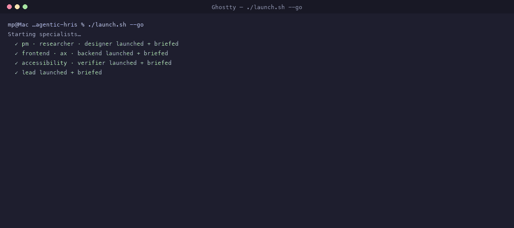

# Example: a Herdr-monitored autonomous agent team

This example stands up a **team of nine world-class Claude agents in a split-pane Herdr grid** and turns them loose to **autonomously build a greenfield agentic-first HRIS** — coordinating with each other, monitored live, pushing toward a single goal with minimal human gates.

It is deliberately the **opposite** of the [hcm-graph](../hcm-graph/README.md) example. Where that one uses Atomic's gated, verified workflows, this one explores **maximum autonomy**: agents talking to agents, driving to done on their own. It's a great way to *see* multi-agent coordination — and an honest look at **why the harness argues for gates and verification** (spoiler: full autonomy drifts; the `verifier` agent is the floor that keeps it honest).



*Nine agents building the HRIS autonomously — delegating and messaging over `herdr agent prompt`, one blocking on an ambiguity and getting unblocked by another agent, then converging. Catppuccin Mocha (Herdr's default theme).*

## What you're watching

- **Herdr** is the cockpit. Nine agents, one per pane; the sidebar shows each one `working` / `blocked` / `done`. You supervise by exception — you only step in on the agent that needs you.
- **The agents communicate with each other** via `herdr agent prompt` — the `lead` delegates tasks, specialists report back, all visible in Herdr. (See the note on "intercom" below.)
- **The work is real:** a Next.js 15 + shadcn/Radix + Vercel AI SDK app with an in-app HR copilot, built under `build/` (git-ignored, created at runtime).

```text
┌──────────────┬──────────────┬──────────────┐
│ lead         │ pm           │ researcher   │
├──────────────┼──────────────┼──────────────┤
│ designer     │ frontend     │ ax           │
├──────────────┼──────────────┼──────────────┤
│ accessibility│ backend      │ verifier     │
└──────────────┴──────────────┴──────────────┘

  lead          — eng lead & orchestrator (owns the how)
  pm            — product: priorities · scope · acceptance (owns the what/why)
  researcher    — decision-ready evidence (domain · stack · a11y)
  designer      — product/interaction design + agentic UX
  frontend      — Next.js · shadcn/ui · Radix · Tailwind
  ax            — the agentic core: HR copilot (Vercel AI SDK)
  backend       — Drizzle + SQLite · server actions · copilot tools
  accessibility — WCAG 2.2 AA guidance + review
  verifier      — independent, fresh-context QA (floor of trust)
```

The goal and definition of done: [MISSION.md](MISSION.md). The role briefs: [team/](team/).

## Step-by-step walkthrough (no experience needed)

Never used a terminal? That's fine. Do these steps **in order**. For each one: type the
command exactly as shown, press **Return**, and check your screen against the picture.

### Step 1 — Open the terminal

Open the app called **Ghostty**. You'll see a window like this — a blank line ending in `%`
is all you need.


### Step 2 — Get the code

Type these two lines, pressing **Return** after each:

```bash
git clone https://github.com/mpaiva/agentic-engineering-harness
cd agentic-engineering-harness
```


### Step 3 — Set up the tools (one command)

```bash
./scripts/setup.sh
```

This installs everything and finishes with a list of green ✓ checkmarks. If any line is a
red ✗, it tells you exactly what to do.


### Step 4 — Log in (one time only)

Two quick logins. Run the first, and a browser opens for you to sign in:

```bash
claude
```

Then, in the same window, start Atomic and log in there too:

```bash
atomic
```

…and type **`/login`**, then choose **Claude Pro/Max**. When both say “logged in”, press
**Ctrl** and **C** together, twice, to leave.


### Step 5 — Start the team

```bash
cd examples/agentic-hris
./launch.sh --go
```

Nine AI agents boot up and get their instructions. When you see **“The team is live”**,
they're off and working.


> First time? Run `./launch.sh` on its own first (no `--go`) — it just **prints the plan**
> and changes nothing, so you can see what will happen before you spend anything.

### Step 6 — Watch them work together

```bash
herdr --session agentic-hris
```

This is your **control room**. Each box is one agent; the lines inside show them **talking
to each other**. The list on the left shows who's *working*, *done*, or *stuck*. You don't
watch all of them — you watch for the one **amber dot** that says it needs you.


### Step 7 — Stop when you've seen enough

Leave the control room by pressing **Ctrl** and **C** together. Then stop the whole team:

```bash
herdr --session agentic-hris server stop
```


---

**Command reference** (once you're comfortable):

```bash
# Claude Code team — coordinates via `herdr agent prompt`
./launch.sh              # dry run — print the plan, change nothing
./launch.sh --layout     # build the split-pane grid only (no paid agents)
./launch.sh --go         # full launch — 9 live agents, autonomous
herdr --session agentic-hris                 # attach and watch
herdr --session agentic-hris agent read lead # peek at the lead's thinking
herdr --session agentic-hris agent send-keys lead esc  # pause the orchestrator
herdr --session agentic-hris server stop     # stop everything

# Atomic team — coordinates via Atomic Intercom (separate Herdr session, so the two
# launchers never collide; you can even run both at once)
./launch-atomic.sh                       # dry run
./launch-atomic.sh --layout              # grid only, named panes, no paid agents
./launch-atomic.sh --go                  # full launch — 9 Atomic sessions (claude-sonnet-5)
./launch-atomic.sh --go --model claude-opus-5
herdr --session agentic-hris-atomic                    # attach and watch
herdr --session agentic-hris-atomic pane read w1:p1    # peek at a pane (panes are named by role)
herdr --session agentic-hris-atomic server stop        # stop everything
```

## Read this before `--go` (the honest part)

- **It spends real tokens, continuously.** Nine agents running autonomously is the most expensive mode in this repo. Watch it and stop it.
- **`--go` starts each agent with `--dangerously-skip-permissions`.** Autonomous agents can't stop to ask permission for every command, so they don't. The guardrails are the isolated `build/` directory and the "only touch `build/`" instruction — **not** a sandbox. For anything beyond a demo, run this on a **throwaway VM / devcontainer**, per [docs/security.md](../../docs/security.md).
- **Full autonomy is experimental and drifts.** Agents may misunderstand each other, duplicate work, or stall. That's the point of the example — it shows the failure modes the harness's gates and verification exist to prevent. The `lead` is told to keep the `verifier` in the loop and to escalate (write `build/BLOCKED.md`) rather than grind. You may still need to `agent prompt lead "…"` to nudge it.
- **The copilot needs an LLM key to *run*.** The team *builds* the Vercel AI SDK integration; running the copilot needs `OPENAI_API_KEY` or `ANTHROPIC_API_KEY` in `build/.env.local` (git-ignored). Never commit a key.

## Two transports: `herdr agent prompt` and Atomic Intercom

This example ships **two launchers**, because there are two ways to make a team of agents talk:

```bash
./launch.sh --go          # nine Claude Code agents, coordinating via `herdr agent prompt`
./launch-atomic.sh --go   # nine Atomic sessions, coordinating via Atomic Intercom
```

**`launch.sh` (Claude Code)** uses `herdr agent prompt`. Herdr natively detects Claude Code
(`herdr agent start --kind claude`), so it fills in the sidebar's working/blocked/done state
itself, and agents address each other by the names Herdr knows them by.

**`launch-atomic.sh` (Atomic)** uses **Intercom** — Atomic's own channel for direct messaging
between sessions on the same machine. Nine independent Atomic sessions, one per pane, each
named with `/name <role>` and sharing an `ATOMIC_INTERCOM_GROUP`, delegate and reply to each
other with `intercom({action: "send" | "ask" | "reply"})`. Two things make this work:

- Atomic is **not** one of Herdr 0.8.0's ~21 known agent kinds, so `herdr agent start`,
  `herdr agent prompt`, and native state detection are all unavailable. Sidebar state instead
  comes from [`atomic/extensions/herdr-state.ts`](../../atomic/extensions/herdr-state.ts),
  which pushes Atomic's lifecycle events into Herdr over its socket API.
- `/name <role>` must land **before** a session's first Intercom call. A session that connects
  to the broker unnamed registers a `subagent-chat-<id>` alias and stays unaddressable by role.

> An earlier version of this note claimed Intercom only works "between stages/sub-agents inside
> a single Atomic workflow" and is "invisible to Herdr" — which is why this example originally
> used `herdr agent prompt` as a substitute. That was wrong: Intercom is session-to-session over
> a local broker, and workflows are just one way to use it. See
> [atomic-intercom](../atomic-intercom/README.md) for the intra-workflow shape.

## What this example teaches

- **Herdr as a multi-agent control room** — split panes, per-agent state, supervision by exception.
- **Agent-to-agent coordination** you can actually see (`herdr agent prompt` / `wait` / `read`).
- **The cost of unbounded autonomy** — and why the other examples put gates and independent verification back in. Compare this run's drift to [hcm-graph](../hcm-graph/README.md)'s gated convergence.
