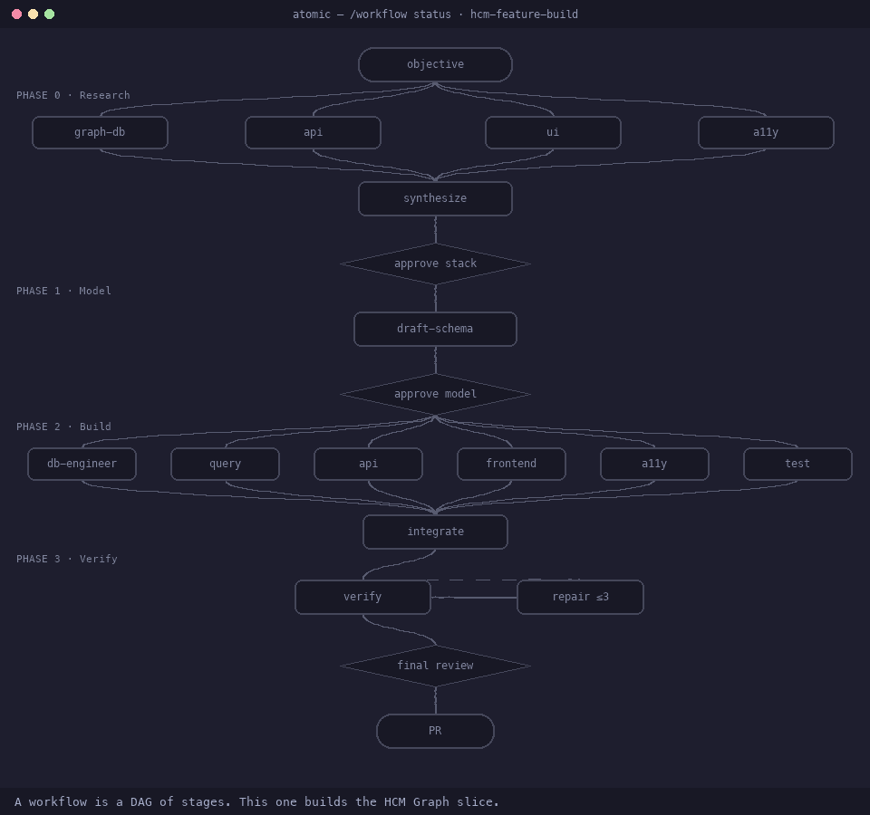

# Example: HCM Graph — a product built by multi-agent Atomic workflows

This is the harness's **big** example: the [operating model](../../docs/operating-model.md) pointed at a real product and run to a finished, verified vertical slice. Where [feature-development](../feature-development/README.md) shows *one* workflow on a toy utility, this shows **four Atomic workflows across four phases**, each fanning out a team of specialist agents, each stopping at a human gate — building a graph-native **Human Capital Management** product from scratch.

**What got built:** the **Core HR slice** — an employee **directory**, a keyboard-navigable **org chart**, and a **person** view, backed by a real **Neo4j** graph, served by a typed **tRPC** API, in a **React Router 7** web app — with graph invariants enforced and WCAG 2.2 AA accessibility. It lives in [`app/`](app/) and is verified against a real database (see [Evidence](#the-evidence)).

## The stack (chosen by agents in Phase 0, approved at a gate)

Neo4j Community 5.x · tRPC + Zod · React Router 7 + Vite · **React Aria `Tree`** (ARIA `tree` pattern) · npm workspaces · Testcontainers · Playwright + axe. Rationale and trade-offs: [research/stack-recommendation.md](research/stack-recommendation.md).

## How it was built — four phases, four workflows

The [agent team](agent-team.md) is wired into an **engineering graph**: each phase is an Atomic workflow that fans out specialists and gates on a human. The contract every stage reads is [PROJECT.md](PROJECT.md); the model is [domain-graph.md](domain-graph.md).

| Phase | Workflow | Specialists fanned out | Gate | Output |
|-------|----------|------------------------|------|--------|
| **0 · Research** | [`hcm-stack-research`](../../atomic/workflows/hcm-stack-research.ts) | graph-db · api · ui · a11y research | approve **stack** | [research/](research/) |
| **1 · Model** | [`hcm-model-design`](../../atomic/workflows/hcm-model-design.ts) | graph-modeler (+ bounded reviewer loop) | approve **model** | [design/schema.md](design/schema.md) |
| **2–3 · Build + Verify** | [`hcm-feature-build`](../../atomic/workflows/hcm-feature-build.ts) | db · query · api · frontend · a11y · test → integrate → independent verify | **final review** → PR | [`app/`](app/) + [artifacts/evidence.md](artifacts/evidence.md) |

## The Atomic workflow screens

**The workflow as a graph.** This is the Atomic half of the stack — the build as a DAG of
stages: the research fan-out, the human gates it *pauses* at, the parallel implementation,
and the verify → gate → PR tail. It runs top to bottom; you watch it with `/workflow status`.



*A faithful **simulation** of Atomic's workflow graph (Catppuccin Mocha) — the real DAG from
[`hcm-feature-build`](../../atomic/workflows/hcm-feature-build.ts) and the four-phase
engineering graph in [agent-team.md](agent-team.md), animated. Static still:
[screens/workflow-graph.svg](screens/workflow-graph.svg). Not a pixel-copy of Atomic's overlay.*

> Contrast this with the Herdr control room in [agentic-hris](../agentic-hris/README.md): Herdr
> shows *agents in panes talking to each other*; Atomic shows *a graph of stages*. Same stack,
> two views — this is the Atomic one.

**All three HCM workflows registered** (`/workflow list`, live capture):

```text
╭ WORKFLOWS  13 registered ────────────────────────────────────────────────────╮
│ hcm-feature-build                                                            │
│   Build and verify the HCM Graph Core-HR slice against the approved sta…     │
│   inputs    objective?  ·  max_repair_cycles?  ·  create_pr?                 │
│ hcm-model-design                                                             │
│   Finalize the HCM Graph Core-HR schema + constraints + seed plan (Neo4…     │
│   inputs    open_questions?  ·  max_review_cycles?                           │
│ hcm-stack-research                                                           │
│   Research the graph DB, API, UI/org-chart, and accessibility choices f…     │
│   inputs    priorities?                                                      │
│ … + feature-development, goal, ralph, fan-out-and-synthesize, …              │
╰──────────────────────────────────────────────────────────────────────────────╯
```

**The input picker** (`/workflow inputs hcm-feature-build`, live capture):

```text
╭ INPUTS FOR HCM-FEATURE-BUILD ────────────────────────────────────────────────╮
│ objective  text  ·  optional                                                 │
│   The verifiable outcome for the slice.                                      │
│   default: "Deliver the Core-HR slice from examples/hcm-graph/PROJECT.md: …" │
│ max_repair_cycles  integer  ·  optional   default: 3                         │
│ create_pr  boolean  ·  optional           default: false                     │
│ 3 inputs · 0 required                                                        │
╰──────────────────────────────────────────────────────────────────────────────╯
```

> **Note on live status screens.** Atomic can't re-render `/workflow status` for the finished runs (the run registry didn't persist them across sessions), so the per-phase stage graphs below are **reconstructed from the workflow definitions and the run outcomes** — faithful to what ran, but not a live screenshot. During a live run you'd watch these with `/workflow status <run-id>` and the graph overlay.

**Phase 0 — `hcm-stack-research`** (fan-out → synthesize → gate):

```text
research-graph-db  ✓ ─┐
research-api       ✓ ─┤
research-ui        ✓ ─┼─► synthesize ✓ ─► HUMAN GATE: approve stack ✓ approved
research-accessibility ✓ ─┘
```

**Phase 1 — `hcm-model-design`** (draft → bounded reviewer loop → gate):

```text
draft-schema ✓ ─► review-1 ✓ (no blocking findings) ─► HUMAN GATE: approve model ✓ approved
```

**Phases 2–3 — `hcm-feature-build`** (parallel build → integrate → independent verify → gate):

```text
db-engineer            ✓ ─┐
query-specialist       ✓ ─┤
api-engineer           ✓ ─┼─► integrate ✓ ─► verify-automated-1 ✓ ─► verify-independent-1 ✓ (0 blocking)
frontend-engineer      ✓ ─┤                                                    │
accessibility-specialist ✓─┤                              0 repair cycles ◄─────┘
test-engineer          ✓ ─┘                                    │
                                          HUMAN GATE: final review ✓ approved ─► (finalize-pr: not authorized)
```

## The evidence

Phase 3 ran **every** check in the contract for real, in a Docker-capable environment (Colima + `neo4j:5-community`). Full log: [artifacts/evidence.md](artifacts/evidence.md).

| Check | Result |
|-------|--------|
| `tsc` — server / web / e2e | **PASS** (exit 0) |
| unit — server (vitest) | **PASS** — 57/57 |
| unit — web (vitest) | **PASS** — 24/24 |
| **integration — real Neo4j** (Testcontainers) | **PASS** — 47/47 (~58 s) |
| **§6 five graph invariants** (each returns 0 rows) | **PASS** — no reporting cycle · ≤1 holder/seat · one org unit/seat · acyclic `PART_OF` · one manager-or-root |
| **§5 four traversals** on the ~200-person seed | **PASS** — reporting chain (dotted line excluded), transitive reports, CEO span, company rollup |
| Playwright e2e | **PASS** — 9/9 |
| org-chart **keyboard walkthrough** (roving tabindex, arrows, Home/End, Enter→panel, Esc→restore) | **PASS** |
| **axe WCAG 2.2 AA** — directory · org-chart · person | **PASS** — 0 violations each |

Repair cycles used: **0**. Approved at the final human gate. `create_pr` was not authorized, so nothing was committed by the workflow.

### An honest note — evidence beats claims

There are two evidence files, and the difference *is* the lesson. An **intermediate** report, [artifacts/test-evidence.md](artifacts/test-evidence.md), flagged two problems: the web app couldn't boot (a missing `entry.server.tsx`) and a stale `treegrid` component test. The **final**, fresh-context verification ([artifacts/evidence.md](artifacts/evidence.md)) re-ran everything and found **both did not reproduce** — resolved in the current tree — and recorded "UNVERIFIED: None." That's the harness's core principle in the wild: a fresh verifier re-deriving the truth from evidence rather than trusting an earlier note.

## Run it yourself

Needs a container runtime for the real Neo4j (Docker Desktop or Colima). From the repo root:

```bash
cd examples/hcm-graph/app
npm install
npm run db:up        # start Neo4j (docker-compose)
npm run migrate      # constraints + indexes
npm run seed         # ~200-person deterministic org
npm run dev          # API on :8787, web on :3000
```

Run the checks:

```bash
npm run test:unit -w @hcm/server                    # 57, no Docker
npm run test:integration -w @hcm/server             # 47, real Neo4j
npm run test:e2e                                    # Playwright + axe
```

Re-run the **workflows** that built it (they read/write under `examples/hcm-graph/`):

```bash
cd ../../..                     # repo root
./scripts/sync-workflows.sh
atomic
# then: /workflow reload  →  /workflow hcm-stack-research  →  hcm-model-design  →  hcm-feature-build
```

## Layout

```text
examples/hcm-graph/
├── README.md          ← you are here (the case study)
├── PROJECT.md         ← the contract: goal · scope · constraints · verification · gates · roadmap
├── domain-graph.md    ← the graph model: nodes, edges, the five invariants
├── agent-team.md      ← the specialists and the engineering graph
├── research/          ← Phase 0 output (graph-db · api · ui · a11y · stack-recommendation)
├── design/            ← Phase 1 output (schema.md)
├── artifacts/         ← Phase 3 evidence (evidence.md · test-evidence.md · phase-2-run-notes.md)
└── app/               ← the built product (server · web · e2e)
```

## What this example teaches

- **Multi-agent, multi-phase** work with Atomic: fan-out research, a synthesis/gate rhythm, then parallel specialist implementation and independent verification.
- **Graph engineering** end to end: a graph *data model* (Neo4j, enforced invariants, traversal queries) built by a graph-shaped *agent team*.
- **Gates where judgment matters** (stack, model, final review) and **bounded repair** (0 cycles needed here, max 3 allowed).
- **Evidence over claims** — the intermediate-vs-final evidence story above.
